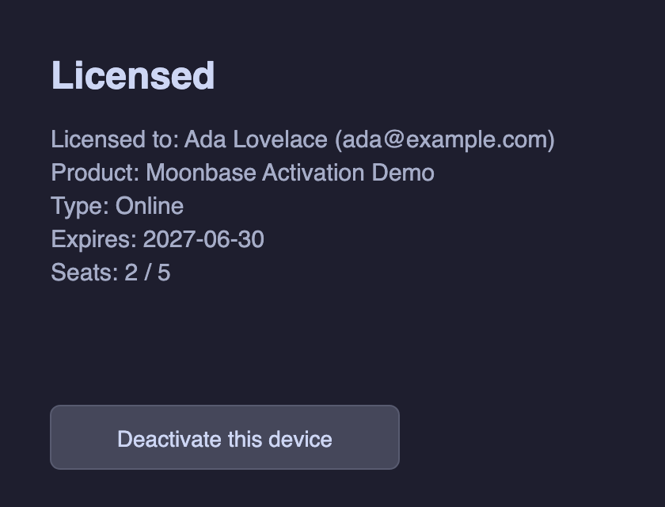
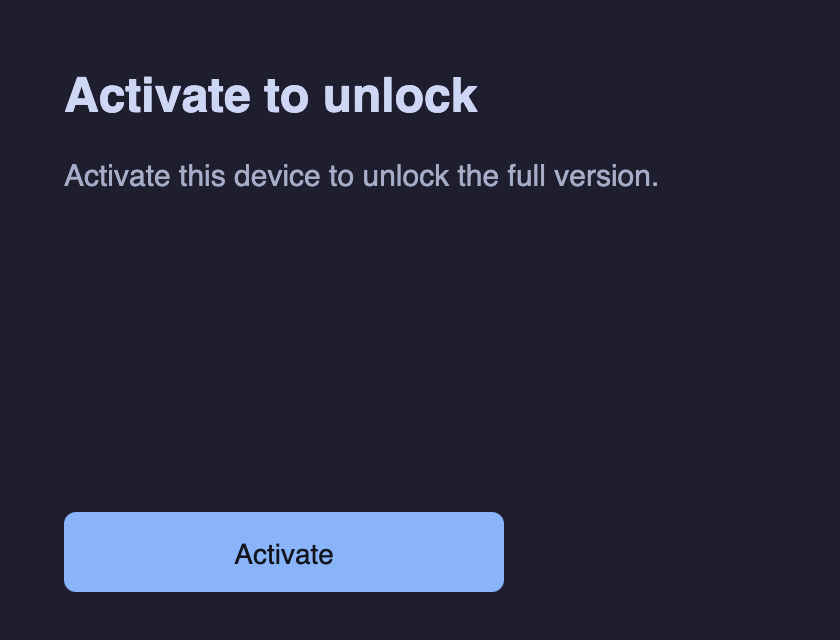
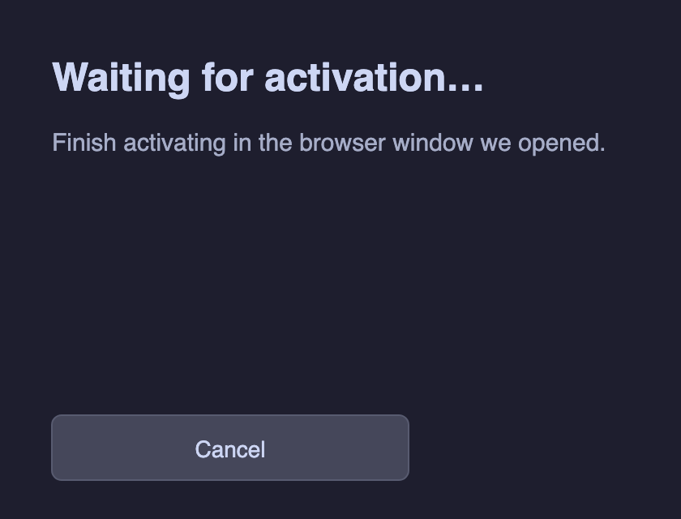
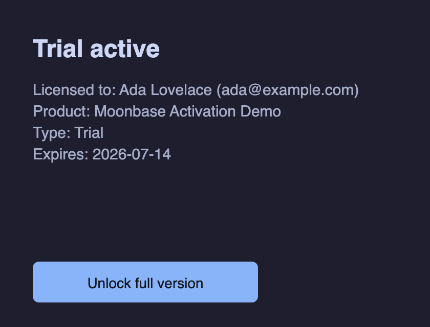

# Moonbase Activation — Pulp licensing reference

A real, loadable Pulp plugin (CLAP / VST3 / AU) **and** a standalone app whose
audio is gated on a [Moonbase](https://github.com/Moonbase-sh/moonbase-cpp)
license, wrapped in an **interactive, Pulp-native activation editor** (no
WebView). Unlicensed, it fades to silence; once activated, it fades back up and
passes audio through.

This is the reference integration for using Moonbase — a third-party
copyright-protection / license-activation service — to commercialize plugins
built on Pulp. Full guide:
[`docs/guides/copyright-protection.md`](../../docs/guides/copyright-protection.md).



## What it shows

- **Drop-in upstream SDK, no fork.** Moonbase is consumed via `FetchContent` at a
  pinned tag (`v3.3.0`). Pulp owns no copy of the SDK.
- **Loadable bundles + standalone.** `pulp_add_plugin` builds CLAP and a
  Standalone app out of the box; VST3 / AU are added automatically when their
  developer-supplied SDKs are present.
- **Interactive editor.** The `ActivationPanel` view wires its button to the
  controller (Activate → browser, Cancel, Deactivate), polls for the fulfilled
  activation from the editor's frame tick, and rebuilds itself as the screen
  changes — all in the Pulp view tree.
- **Rich license details.** The Details screen surfaces the full validated
  `moonbase::license`: licensed-to name + email, product, activation type,
  expiry, and seat usage.
- **Click-free gate.** A 12 ms `SmoothedValue` ramp fades audio in/out on a
  license flip, so gating never clicks.
- **Non-blocking startup.** `start_async()` applies a stored license
  synchronously (the editor opens unlocked instantly) and re-validates online on
  a background thread; the result is applied on the UI thread by `pump()`.
- **Pulp HTTP transport, no libcurl.** `PulpMoonbaseHttpTransport` implements
  Moonbase's injected `http_transport` over Pulp's bundled `cpp-httplib`/mbedTLS
  stack (`MOONBASE_USE_CURL=OFF`).
- **RS256 validation via OpenSSL** (the upstream default, required + linked by
  v3.3.0 regardless). OS-native crypto is a future option once upstream makes
  OpenSSL conditional on the backend.
- **Audio-thread gating** on a single `std::atomic<bool>` — the only thing the
  audio thread reads. All network/validation runs off the audio thread.
- **`moonbase-pulp` User-Agent.** Requests are tagged
  `moonbase-pulp/<version> (GenerousCorp Pulp; <OS>)`, mirroring Moonbase's JUCE
  module so they can attribute Pulp-driven traffic.
- **Per-user license store** under the platform data directory
  (`~/Library/Application Support/Pulp/…`, `%APPDATA%\Pulp\…`,
  `~/.local/share/pulp/…`).
- **Theme-driven UI** — all colors resolve from `pulp::view::Theme` tokens (Ink &
  Signal); no hard-coded Moonbase palette.

## Screenshots

Rendered headlessly through Pulp's Skia path (no window, no audio) by the
`moonbase-activation-screenshots` tool. Regenerate with:

```bash
cmake --build build --target moonbase-activation-screenshots
./build/examples/moonbase-activation/moonbase-activation-screenshots \
    examples/moonbase-activation/docs/screenshots
```

| Welcome | Browser wait | Licensed | Trial |
|---|---|---|---|
|  |  |  |  |

## Build, test, run

It is **off by default** (it fetches the Moonbase SDK and needs OpenSSL at
configure time — an upstream v3.3.0 CMake requirement).

```bash
cmake -S . -B build -DCMAKE_BUILD_TYPE=Release -DPULP_BUILD_MOONBASE_EXAMPLE=ON

# Validation tests (network-free)
cmake --build build --target pulp-moonbase-activation-test
ctest --test-dir build -R moonbase --output-on-failure

# Loadable plugin + standalone app + screenshots
cmake --build build --target MoonbaseActivation_CLAP \
                              MoonbaseActivation_Standalone \
                              moonbase-activation-screenshots
```

OpenSSL is auto-discovered (Homebrew `openssl@3` on macOS); override with
`-DOPENSSL_ROOT_DIR=...`. For an offline build, point at a local checkout with
`-DMOONBASE_LOCAL_DIR=/path/to/moonbase-cpp` (a sibling `../moonbase-cpp` is
detected automatically).

## Use it for real

Replace the demo `endpoint`, `product_id`, and `public_key` in
`moonbase_activation_plugin.hpp` with your Moonbase product's values. The demo
public key is a throwaway key that only lets the SDK construct; it cannot
validate real Moonbase tokens. The `Drive` / `Mix` parameters are real,
host-automatable parameters that deliberately don't process audio — the example's
point is the activation workflow around a real plugin surface, not the DSP.

## Acknowledgements

The activation **UX and workflow** here are modeled on Moonbase's own MIT-licensed
JUCE reference implementations — the `moonbase_licensing` native module and the
[DRIFT](https://github.com/Moonbase-sh/moonbase-cpp) / HALO reference plugins
(headless controller as the source of truth, an audio-thread-safe licensed flag,
a license-details screen, browser activation with polling, and a click-free
gate). This is a **clean-room reimplementation against Pulp's own APIs**: it
contains **no JUCE and no code copied from those projects** — Pulp's view/canvas
stack for the UI, `cpp-httplib`/mbedTLS for HTTP, and the MIT `moonbase-cpp` SDK
for licensing. Thanks to the Moonbase team for the SDK and the reference designs.

## Files

| File | Role |
|------|------|
| `moonbase_pulp_transport.hpp` | `http_transport` over Pulp's cpp-httplib/mbedTLS |
| `moonbase_activation_controller.hpp` | Thin router over the Moonbase SDK + the `licensed` atomic + `moonbase-pulp` User-Agent + async start/pump |
| `moonbase_activation_view.hpp` | Native theme-driven panel: static builder + interactive `ActivationPanel` + rich details |
| `moonbase_activation_plugin.hpp` | The gated `Processor` (click-free fade gate, editor wiring, factory) |
| `platform_open_url.hpp` | Shell-injection-safe system-browser opener for the activation handoff |
| `clap_entry.cpp` / `vst3_entry.cpp` / `au_v2_entry.cpp` / `main.cpp` | Format + standalone entry points |
| `capture_screens.cpp` | Headless screenshot generator (docs imagery) |
| `test_moonbase_activation.cpp` | Network-free validation (User-Agent, gating + fade, state machine, interactive panel, details, async start, render) |
